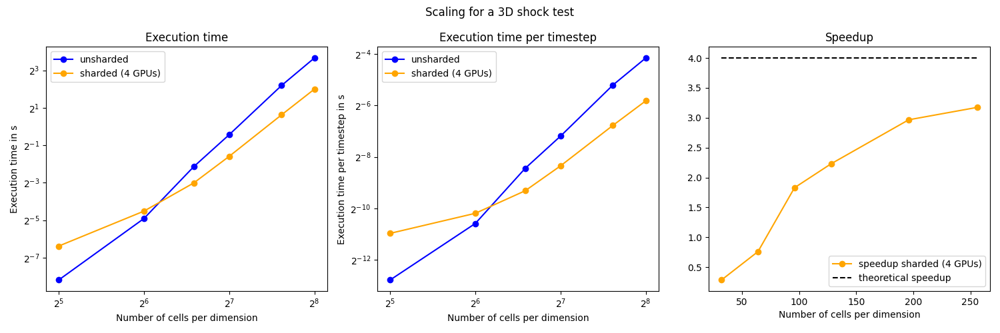
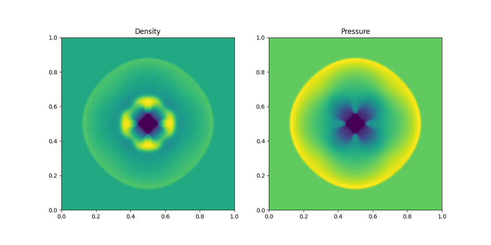

# tinyfluids

tinyfluids aims to contain a collection of small, simple 3D fluid simulators (first order Godunov schemes with HLL solver). Our goal is to find a strategy, to efficiently scale these simulations to multiple GPUs and later multiple nodes and to downstream these findings to our more advanced astrophysical magnetohydrodynamics + self gravity code [jf1uids](https://github.com/leo1200/jf1uids).

## jax_tinyfluids - the baseline

Our [baseline implementation](tinyfluids/jax_tinyfluids/jax_tinyfluids.py) in `JAX` scales to multiple GPUs (and nodes) automatically via `JAX`'s "parallelization follows data" approach. With this we nearly get perfect scaling at sufficiently large problem sizes. NOTE THAT WHEN USING SLICING AND NOT JNP.ROLL, SCALING WILL BE VERY BAD. This led me to write a custom shardmapped version in the first place - which scales well but not as well as pure jax with only jnp.roll.

|  |
|:--------------------------------------------:|
| Scaling Plot                                 |

|   |
|:----------------------------------------------:|
| Example Simulation with (1024)^3 Cells         |

## parallelization strategies

- the classical approach, as done in [JAXFLUIDS 2.0](https://arxiv.org/abs/2402.05193) would be a domain decomposition into patches with halo cells and halo exchange, efficient halo exchange is e.g. implemented in [jaxDecomp](https://github.com/DifferentiableUniverseInitiative/jaxDecomp) based on NVIDIA's [cuDecomp](https://nvidia.github.io/cuDecomp/index.html)